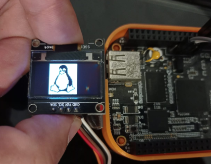

# SSD1306 Tool

The `ssd1306-tool` is a versatile command-line utility designed for interacting with SSD1306 OLED displays on Linux systems. It offers a range of functionalities from basic display control to advanced graphical capabilities. This tool serves as a demonstration of direct display management and can be integrated into more comprehensive UI frameworks like LVGL for sophisticated user interfaces.

## Features

- **Clear Screen**: Easily clear the display with a single command.
- **Rotate Display**: Adjust the display orientation by setting the rotation angle to either 0 or 180 degrees.
- **Horizontal Flip**: Flip the display horizontally to adjust for different mounting orientations.
- **Display Pixel Invert**: Invert the color of pixels on the display for enhanced visibility under certain conditions.
- **Set Pixel**: Precisely control the state (on/off) of individual pixels on the display.
- **Display GIF Animation**: Showcase GIF animations at specified positions on the screen.
- **Draw Area (Image)**: Render images at designated locations, providing the foundation for integrating with UI frameworks for rich user interfaces.

## Usage

Below are the command-line options available for `ssd1306-tool`:

```bash
ssd1306-tool -h
Usage:
 -h Help (shows this usage information)
 -c Clear screen (no additional parameters required)
 -r <angle> Set rotate angle (0 or 180)
 -f <state> Horizontal flip (1 or 0 for on/off)
 -z <state> Display Pixel Invert (1 or 0 for on/off)
 -p <X> <Y> <state> Set pixel at X,Y with state S (1 for on, 0 for off)
 -g <X> <Y> <N> Display Gif Animation at X,Y with N as gif index, [0, 1 or 2]
 -i <X> <Y> <N> Draw area (Image) at X,Y with N as img index, [0, 1 or 2]
```

## Examples

- Clear the screen:
  ```bash
  ssd1306-tool -c
  ```

- Set a pixel at position (10, 10) to on:
  ```bash
  ssd1306-tool -p 10 10 1
  ```

- Display a GIF animation at position (0, 0) with index 1:
  ```bash
  ssd1306-tool -g 0 0 1
  ```

- Draw an image at position (0, 0) with index 2:
  ```bash
  ssd1306-tool -i 0 0 2
  ```

## Integration with UI Frameworks

The `-i` command demonstrates the tool's capability to render images, making it a powerful feature when integrated into UI frameworks such as LVGL. This allows for the development of rich graphical user interfaces on devices equipped with the SSD1306 display.

## Extending the Tool

This tool is designed to be simple and demonstrative of direct interactions with the SSD1306 display. Developers are encouraged to extend its functionality or integrate it into larger projects to fully leverage the display's capabilities.

## License

This project is licensed under the [MIT License](LICENSE). See the LICENSE file for details.

## Acknowledgments

- Thanks to the Linux and embedded systems community for providing the inspiration and foundation for this tool.


## Demonstrations

Here are some examples of images and GIFs rendered using `ssd1306-tool`:

- **Image 1**: Simple Image.

  

- **GIF Animation 1**: Check out the tool in action, displaying GIF animations on the SSD1306 OLED display:.

    [](https://youtube.com/shorts/hyiFeo10UvE?si=8pCxos1RFETMQeHS)

## Author

**Bayron Cabrera**

- **GitHub:** https://github.com/bdcabreran
- **LinkedIn:** https://www.linkedin.com/in/bayron-cabrera-517821124/
- **Email:** bayron.nanez@gmail.com